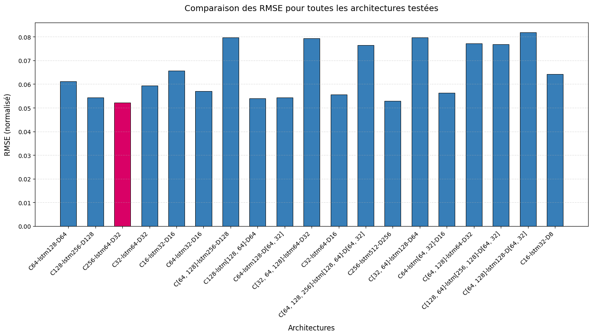
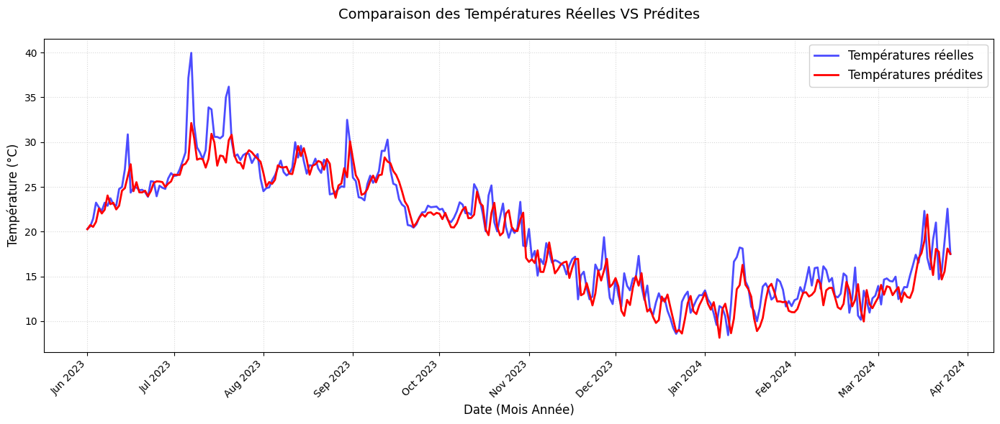
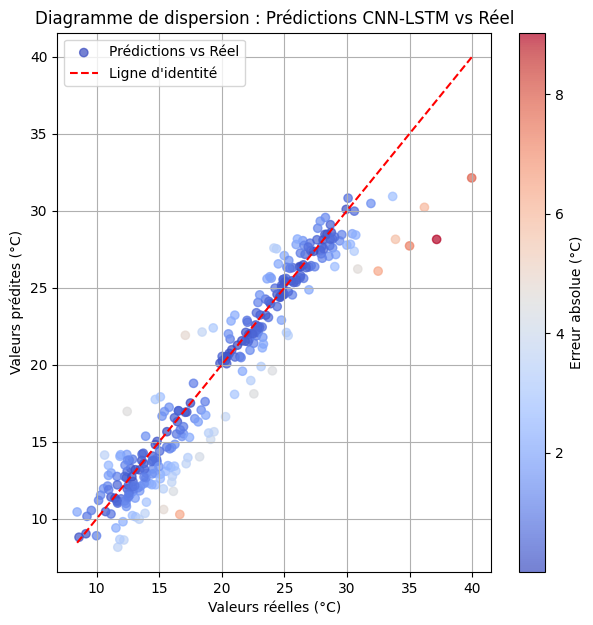

# CNN-LSTM Temperature Forecasting
Undergraduate final project done for a Bachelor's degree in Operational Research. 

This project aims to predict the temperature in Algiers based on multivariate climate data, using a **hybrid CNN-LSTM neural network model** to capture both feature interactions and temporal dependencies.

**Key Features:**
- Combines CNN for local pattern extraction with LSTM for temporal dependency modeling
- Multivariate approach using 5 climate variables
- 8 years of historical weather data (2016-2024)
- Achieves **1.94°C RMSE** on unseen test set

## Results

### Performance Metrics

| Metric | Value |
|--------|-------|
| **RMSE (Test)** | 1.94°C |
| **MAE (Test)** | ~1.26°C |
| **Relative Error** | 6.3% |
| **Parameters** | 90,945 |

### Model Comparison

<p align="center">
  
  <br>
  <em>Comparison of RMSE across different CNN-LSTM architectures</em>
</p>

### Predictions vs Actual Temperature

<p align="center">
  
  <br>
  <em>Time series comparison showing excellent tracking of seasonal patterns</em>
</p>

### Prediction Accuracy

<p align="center">
  
  <br>
  <em>Scatter plot demonstrating strong correlation between predictions and actual values</em>
</p>

## Model Architecture

```
Input Shape: (timesteps, 5 features)
    ↓
Conv1D(256 filters, kernel=3, activation=relu)
    ↓
MaxPooling1D(pool_size=2)
    ↓
LSTM(64 units)
    ↓
Dense(32 units, activation=relu)
    ↓
Dense(1 unit, activation=linear)
    ↓
Output: Temperature (°C)
```


**Summary:**
- **Total Parameters:** 90,945
- **Trainable Parameters:** 90,945
- **Optimizer:** Adam
- **Loss Function:** Mean Squared Error (MSE)

## Dataset

### Overview
- **Location:** Algiers, Algeria
- **Period:** June 2016 - April 2024 (8 years)
- **Frequency:** Daily observations
- **Source:** [rp5.ru Weather Archives](https://rp5.ru/Archives_météo_à_Alger_(port))

### Features (Input Variables)

| Variable | Description | Unit |
|----------|-------------|------|
| Temperature | Air temperature | °C |
| Pressure | Atmospheric pressure | hPa |
| Humidity | Relative humidity | % |
| Wind Speed | Average wind speed | m/s |
| Dew Point | Dew point temperature | °C |

### Data Split
- **Training:** 80% (2016-2022)
- **Validation:** 10% (2023)
- **Test:** 10% (2024)

### Temperature Statistics

| Set | Min (°C) | Max (°C) | Range (°C) |
|-----|----------|----------|------------|
| **Actual** | 8.44 | 39.96 | 31.52 |
| **Predicted** | 7.85 | 32.25 | 24.40 |


## Methodology

### 1. Data Preprocessing
- Normalization using MinMaxScaler (0-1 range)
- Sliding window approach for sequence creation
- Handling missing values and outliers

### 2. Model Training
- **Epochs:** 50 with Early Stopping (patience=10)
- **Batch Size:** 32
- **Validation Strategy:** Temporal split to prevent data leakage
- **Callbacks:** ModelCheckpoint, EarlyStopping

### 3. Evaluation
- RMSE (Root Mean Squared Error)
- MAE (Mean Absolute Error)
- Visual analysis of predictions vs actual values

## Strengths

 **- Excellent Accuracy:** RMSE of 1.94°C is comparable to operational weather models  
 **- Captures Seasonality:** Successfully tracks seasonal temperature variations    
 **- Lightweight and efficient model** Only 90K parameters, suitable for resource-constrained environments  
 **- Multivariate Approach:** Leverages multiple climate variables for robust predictions  
 **- No Overfitting:** Validation and test performance are consistent  

## Limitations

**- Extreme Temperature Underestimation:** Model predicts max 32.25°C vs actual 39.96°C  
**- Extrapolation Challenge** 


### Why Extreme Temperatures Are Difficult

The test set (2024) contains unprecedented heat records not present in the training data (2016-2022), which explains the slightly higher RMSE. Despite this difficult extrapolation, the model maintains an error of only 1.94°C.

 Neural networks typically struggle with extrapolation beyond their training range, leading to regression toward the mean. This is a known limitation, not a model failure.


## Future Improvements

Potential enhancements to consider:

1. **Weighted Loss Function:** Penalize errors on extreme temperatures more heavily
2. **Data Augmentation:** Synthesize additional extreme temperature samples
3. **Cyclical Features:** Encode seasonal patterns (month, day of year)
4. **Multi-step Forecasting:** Predict temperature for next 7-14 days
5. **Transfer Learning:** Adapt model to other geographic locations

---
